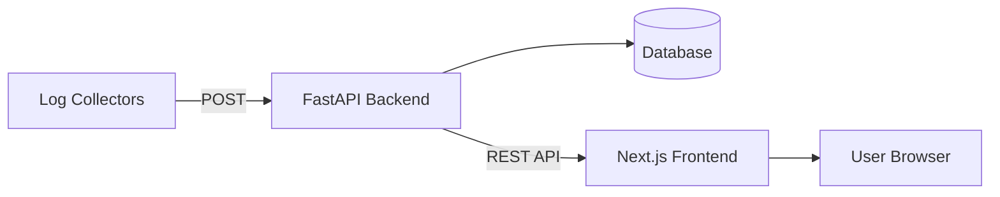

# Architecture Overview

This document describes the architecture of the SOC Dashboard.

## System Overview

## Frontend Architecture
- **Next.js App Router**: Utilizes the modern React paradigm for Server and Client Components.
- **Component Hierarchy**: Follows Atomic Design principles.

## Backend Architecture
- **FastAPI**: Serves RESTful endpoints.
- **Serverless Ready**: Can be deployed to platforms like Vercel or AWS Lambda.

## Data Flow
Collector → API → Database → Dashboard

## State Management
- React Context and Hooks for local state.
- SWR for data fetching and caching.

## Security Considerations
- Authentication and Authorization (API Keys, JWT).
- Input validation using Pydantic.
- HTTPS everywhere.

## Technology Choices
- Next.js: For SEO and SSR.
- FastAPI: For async performance and automatic OpenAPI docs.
